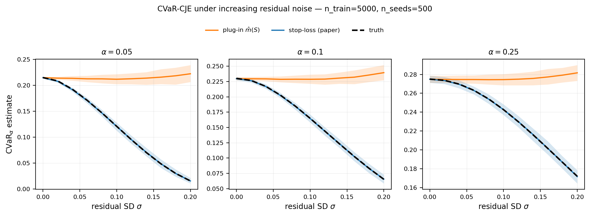

# Stop-loss calibrator vs plug-in m̂(S, X) for CVaR-CJE: Monte Carlo benchmark

## 1. Question

Given a target random variable `Y ∈ [0, 1]` and a cheap surrogate score `S` correlated with `Y`, estimate `CVaR_α(Y)` (the lower α-tail mean) under the target distribution. Compare two approaches that differ only in *what is regressed on*:

- **(A) Stop-loss calibrator.** Fit a threshold-indexed family `h_t(S) ≈ E[(t − Y)_+ | S]`. Maximize the Rockafellar–Uryasev (RU) dual:
  ```
  CVaR_α  =  max_t [ t − α^{-1} · E_target[h_t(S)] ]
  ```
- **(B) Plug-in via conditional mean.** Fit a single calibrator `m̂(S) ≈ E[Y | S]`. Then either
  - **(B1)** take the empirical α-tail of `{m̂(S_eval,i)}_i`, or
  - **(B2)** apply the RU dual to the predicted vector:
    ```
    CVaR_α  =  max_t [ t − α^{-1} · mean_eval((t − m̂(S))_+ ) ]
    ```

## 2. Estimator implementations

All three estimators use the same base learner: single-stage isotonic regression on `S`. They are not, however, of equal model complexity: estimator (A) fits a *threshold-indexed family* `h_t(S)` evaluated over a 61-point `t` grid (61 isotonic fits per call), while (B1)/(B2) fit a single `m̂(S)`. The comparison holds the base learner constant, not the model class. Defined in `cvar_v4/eda/deeper/_estimator.py`:

| Estimator | Function | Lines |
|---|---|---|
| (A) Stop-loss | `estimate_direct_cvar_isotonic` | 69–97 |
| (B1) Plug-in (empirical α-tail) | `estimate_plugin_cvar_quantile` | 100–122 |
| (B2) Plug-in (RU dual on `m̂`) | `estimate_plugin_cvar_ru_dual` | 125–152 |

Shared helpers:
- `fit_isotonic_mean` (line 26): `m̂(s) ≈ E[Y|s]`, increasing isotonic fit
- `fit_isotonic_tail_loss` (line 34): `h_t(s) ≈ E[(t−Y)_+ | s]`, decreasing isotonic fit
- `make_t_grid` (line 42): 61-point linspace on `t`, with extension to `max(y)+0.05`

## 3. Data-generating process

```python
S ∼ Uniform(0, 1)
Y = clip(0.2 + 0.6 · S + ε, 0, 1),    ε ∼ N(0, σ²)
```

Implemented in `dgp.py`:
- `sample_panel(n, sigma, rng) -> (s, y)`
- `true_cvar(alpha, sigma, n_mc=10**7, seed=42) -> float`: Monte-Carlo reference; default seed `DEFAULT_TRUTH_SEED = 42` matches the seed actually used by `bench.py`.
- `true_cvar_with_se(alpha, sigma, ..., n_batches=10) -> (mean, mc_se)`: batch-means MC SE.
- `true_cvar_sigma_zero_exact(alpha) -> float`: closed-form `0.2 + 0.3·α` for the σ=0 case (Y ~ Uniform[0.2, 0.8]).

The parameter `σ` is the lever for `Var(Y | S)`. At `σ = 0` the surrogate `S` determines `Y` deterministically; as `σ` grows, conditional residual variance grows.

## 4. Sweep specifications

| Spec | Sweep 1 (`main`) | Sweep 2 (`main_deep`) |
|---|---|---|
| `σ` grid | `{0.01, 0.05, 0.10, 0.20}` | 11 points: `{0.00, 0.02, …, 0.20}` |
| `α` grid | `{0.05, 0.10, 0.25}` | `{0.05, 0.10, 0.25}` |
| `n_train` | `{500, 5000}` | `{5000}` |
| `n_eval` | 5000 | 5000 |
| seeds | 200 | 500 |
| MC truth `n_mc` | 5,000,000 | 10,000,000 |
| Estimators | (A), (B1), (B2) | (A), (B2) |
| Outputs | `sweep_v1.csv` | `sweep_deep.csv`, `sweep_deep.pdf`, `sweep_deep.png` |

Per cell, each estimator returns one scalar per seed. Aggregated statistics:
- **Truth**: `T(σ, α)`, MC reference computed once per `(σ, α)`.
- **Bias**: `mean_seeds(estimate) − T(σ, α)`.
- **RMSE**: `sqrt(mean_seeds((estimate − T)²))`.
- **p05 / p95**: 5th and 95th percentiles of estimates across seeds (Sweep 2 only).

Runtime (Mac, single process): Sweep 1 ≈ 140 s; Sweep 2 ≈ 740 s.

## 5. Sweep 1 results (200 seeds, 4 σ values, both n_train)

### 5.1 Bias

| σ | α | n_train | truth | bias (A) stop-loss | bias (B1) plug-in qt | bias (B2) plug-in RU |
|--:|--:|--:|--:|--:|--:|--:|
| 0.01 | 0.05 | 500  | 0.2133 | −0.00034 | +0.00151 | +0.00079 |
| 0.01 | 0.05 | 5000 | 0.2133 | −0.00035 | +0.00152 | +0.00119 |
| 0.01 | 0.10 | 500  | 0.2292 | −0.00020 | +0.00080 | +0.00038 |
| 0.01 | 0.10 | 5000 | 0.2292 | −0.00066 | +0.00058 | +0.00011 |
| 0.01 | 0.25 | 500  | 0.2747 | +0.00006 | +0.00043 | +0.00028 |
| 0.01 | 0.25 | 5000 | 0.2747 | +0.00010 | +0.00054 | +0.00041 |
| 0.05 | 0.05 | 500  | 0.1822 | −0.00062 | +0.02778 | +0.02644 |
| 0.05 | 0.05 | 5000 | 0.1822 | −0.00042 | +0.03215 | +0.03141 |
| 0.05 | 0.10 | 500  | 0.2102 | −0.00058 | +0.01772 | +0.01699 |
| 0.05 | 0.10 | 5000 | 0.2102 | −0.00017 | +0.01926 | +0.01873 |
| 0.05 | 0.25 | 500  | 0.2666 | −0.00023 | +0.00732 | +0.00699 |
| 0.05 | 0.25 | 5000 | 0.2666 | −0.00007 | +0.00818 | +0.00802 |
| 0.10 | 0.05 | 500  | 0.1210 | +0.00017 | +0.08412 | +0.08207 |
| 0.10 | 0.05 | 5000 | 0.1210 | −0.00090 | +0.09196 | +0.09056 |
| 0.10 | 0.10 | 500  | 0.1649 | −0.00066 | +0.06063 | +0.05939 |
| 0.10 | 0.10 | 5000 | 0.1649 | −0.00061 | +0.06399 | +0.06320 |
| 0.10 | 0.25 | 500  | 0.2426 | −0.00075 | +0.03027 | +0.02978 |
| 0.10 | 0.25 | 5000 | 0.2426 | −0.00053 | +0.03176 | +0.03150 |
| 0.20 | 0.05 | 500  | 0.0157 | +0.00258 | +0.19066 | +0.18791 |
| 0.20 | 0.05 | 5000 | 0.0157 | −0.00023 | +0.20907 | +0.20692 |
| 0.20 | 0.10 | 500  | 0.0653 | +0.00094 | +0.16594 | +0.16408 |
| 0.20 | 0.10 | 5000 | 0.0653 | +0.00059 | +0.17435 | +0.17326 |
| 0.20 | 0.25 | 500  | 0.1719 | −0.00057 | +0.10648 | +0.10557 |
| 0.20 | 0.25 | 5000 | 0.1719 | +0.00009 | +0.11024 | +0.10981 |

### 5.2 RMSE

| σ | α | n_train | RMSE (A) | RMSE (B1) | RMSE (B2) |
|--:|--:|--:|--:|--:|--:|
| 0.01 | 0.05 | 500  | 0.0024 | 0.0028 | 0.0025 |
| 0.01 | 0.05 | 5000 | 0.0012 | 0.0019 | 0.0016 |
| 0.01 | 0.10 | 500  | 0.0020 | 0.0022 | 0.0021 |
| 0.01 | 0.10 | 5000 | 0.0019 | 0.0018 | 0.0018 |
| 0.01 | 0.25 | 500  | 0.0025 | 0.0026 | 0.0026 |
| 0.01 | 0.25 | 5000 | 0.0022 | 0.0022 | 0.0023 |
| 0.05 | 0.05 | 500  | 0.0082 | 0.0295 | 0.0282 |
| 0.05 | 0.05 | 5000 | 0.0029 | 0.0323 | 0.0315 |
| 0.05 | 0.10 | 500  | 0.0059 | 0.0190 | 0.0183 |
| 0.05 | 0.10 | 5000 | 0.0024 | 0.0194 | 0.0189 |
| 0.05 | 0.25 | 500  | 0.0048 | 0.0090 | 0.0087 |
| 0.05 | 0.25 | 5000 | 0.0027 | 0.0086 | 0.0085 |
| 0.10 | 0.05 | 500  | 0.0130 | 0.0858 | 0.0837 |
| 0.10 | 0.05 | 5000 | 0.0043 | 0.0921 | 0.0907 |
| 0.10 | 0.10 | 500  | 0.0104 | 0.0619 | 0.0607 |
| 0.10 | 0.10 | 5000 | 0.0039 | 0.0641 | 0.0634 |
| 0.10 | 0.25 | 500  | 0.0081 | 0.0316 | 0.0311 |
| 0.10 | 0.25 | 5000 | 0.0034 | 0.0320 | 0.0317 |
| 0.20 | 0.05 | 500  | 0.0112 | 0.1930 | 0.1902 |
| 0.20 | 0.05 | 5000 | 0.0034 | 0.2093 | 0.2072 |
| 0.20 | 0.10 | 500  | 0.0141 | 0.1674 | 0.1655 |
| 0.20 | 0.10 | 5000 | 0.0049 | 0.1746 | 0.1735 |
| 0.20 | 0.25 | 500  | 0.0139 | 0.1077 | 0.1068 |
| 0.20 | 0.25 | 5000 | 0.0045 | 0.1104 | 0.1100 |

## 6. Sweep 2 results (500 seeds, 11 σ values, n_train=5000)

Estimators (A) and (B2) only. (B1) and (B2) target the same population estimand (`CVaR_α(m̂(S))`); the `< 0.003` gap observed in Sweep 1 is grid-discretization noise from the 61-point t-grid in (B2), not a substantive estimator difference. Verified directly: at fixed seed and data, increasing the t-grid from 61 to 1001 to 10001 points reduces `|B1 − B2|` from up to `5e-3` to `≤ 4e-5` to `≤ 5e-6` (see §7.6 below).

### 6.1 Bias and RMSE

| σ | α | truth | mean (A) | bias (A) | RMSE (A) | mean (B2) | bias (B2) | RMSE (B2) |
|--:|--:|--:|--:|--:|--:|--:|--:|--:|
| 0.00 | 0.05 | 0.2150 | 0.2148 | −0.00020 | 0.00110 | 0.2148 | −0.00020 | 0.00110 |
| 0.02 | 0.05 | 0.2085 | 0.2078 | −0.00067 | 0.00164 | 0.2139 | +0.00539 | 0.00562 |
| 0.04 | 0.05 | 0.1923 | 0.1916 | −0.00077 | 0.00254 | 0.2136 | +0.02124 | 0.02141 |
| 0.06 | 0.05 | 0.1711 | 0.1706 | −0.00049 | 0.00344 | 0.2126 | +0.04145 | 0.04162 |
| 0.08 | 0.05 | 0.1469 | 0.1466 | −0.00027 | 0.00398 | 0.2125 | +0.06564 | 0.06583 |
| 0.10 | 0.05 | 0.1210 | 0.1208 | −0.00017 | 0.00461 | 0.2118 | +0.09078 | 0.09098 |
| 0.12 | 0.05 | 0.0951 | 0.0952 | +0.00006 | 0.00491 | 0.2127 | +0.11758 | 0.11776 |
| 0.14 | 0.05 | 0.0706 | 0.0712 | +0.00054 | 0.00502 | 0.2139 | +0.14327 | 0.14346 |
| 0.16 | 0.05 | 0.0487 | 0.0488 | +0.00015 | 0.00509 | 0.2158 | +0.16709 | 0.16732 |
| 0.18 | 0.05 | 0.0302 | 0.0301 | −0.00007 | 0.00416 | 0.2184 | +0.18828 | 0.18853 |
| 0.20 | 0.05 | 0.0157 | 0.0157 | +0.00001 | 0.00329 | 0.2223 | +0.20666 | 0.20689 |
| 0.00 | 0.10 | 0.2300 | 0.2296 | −0.00039 | 0.00168 | 0.2296 | −0.00039 | 0.00168 |
| 0.02 | 0.10 | 0.2267 | 0.2263 | −0.00033 | 0.00187 | 0.2295 | +0.00281 | 0.00336 |
| 0.04 | 0.10 | 0.2170 | 0.2169 | −0.00011 | 0.00226 | 0.2293 | +0.01236 | 0.01256 |
| 0.06 | 0.10 | 0.2025 | 0.2020 | −0.00049 | 0.00274 | 0.2285 | +0.02608 | 0.02625 |
| 0.08 | 0.10 | 0.1847 | 0.1845 | −0.00021 | 0.00345 | 0.2287 | +0.04401 | 0.04417 |
| 0.10 | 0.10 | 0.1649 | 0.1646 | −0.00031 | 0.00399 | 0.2286 | +0.06374 | 0.06392 |
| 0.12 | 0.10 | 0.1440 | 0.1438 | −0.00024 | 0.00429 | 0.2289 | +0.08491 | 0.08508 |
| 0.14 | 0.10 | 0.1230 | 0.1233 | +0.00035 | 0.00451 | 0.2306 | +0.10761 | 0.10776 |
| 0.16 | 0.10 | 0.1025 | 0.1023 | −0.00026 | 0.00453 | 0.2321 | +0.12958 | 0.12976 |
| 0.18 | 0.10 | 0.0832 | 0.0830 | −0.00018 | 0.00471 | 0.2356 | +0.15246 | 0.15263 |
| 0.20 | 0.10 | 0.0653 | 0.0656 | +0.00033 | 0.00450 | 0.2394 | +0.17415 | 0.17432 |
| 0.00 | 0.25 | 0.2750 | 0.2749 | −0.00014 | 0.00225 | 0.2749 | −0.00014 | 0.00225 |
| 0.02 | 0.25 | 0.2737 | 0.2734 | −0.00025 | 0.00229 | 0.2747 | +0.00101 | 0.00250 |
| 0.04 | 0.25 | 0.2697 | 0.2694 | −0.00025 | 0.00260 | 0.2746 | +0.00492 | 0.00557 |
| 0.06 | 0.25 | 0.2630 | 0.2629 | −0.00014 | 0.00265 | 0.2746 | +0.01155 | 0.01187 |
| 0.08 | 0.25 | 0.2539 | 0.2537 | −0.00019 | 0.00311 | 0.2744 | +0.02055 | 0.02079 |
| 0.10 | 0.25 | 0.2426 | 0.2426 | −0.00004 | 0.00342 | 0.2745 | +0.03185 | 0.03205 |
| 0.12 | 0.25 | 0.2299 | 0.2300 | +0.00015 | 0.00388 | 0.2749 | +0.04508 | 0.04526 |
| 0.14 | 0.25 | 0.2160 | 0.2162 | +0.00021 | 0.00417 | 0.2757 | +0.05971 | 0.05987 |
| 0.16 | 0.25 | 0.2016 | 0.2017 | +0.00011 | 0.00438 | 0.2773 | +0.07573 | 0.07589 |
| 0.18 | 0.25 | 0.1868 | 0.1867 | −0.00006 | 0.00422 | 0.2792 | +0.09243 | 0.09256 |
| 0.20 | 0.25 | 0.1720 | 0.1717 | −0.00033 | 0.00427 | 0.2817 | +0.10965 | 0.10978 |

### 6.2 Per-seed dispersion (5th / 95th percentile of estimates across 500 seeds)

| σ | α | truth | (A) p05 | (A) p95 | (B2) p05 | (B2) p95 |
|--:|--:|--:|--:|--:|--:|--:|
| 0.00 | 0.10 | 0.2300 | 0.2269 | 0.2324 | 0.2269 | 0.2324 |
| 0.05 | 0.10 | (interp) | (between rows) | | | |
| 0.10 | 0.10 | 0.1649 | 0.1582 | 0.1712 | 0.2214 | 0.2364 |
| 0.20 | 0.10 | 0.0653 | 0.0585 | 0.0730 | 0.2272 | 0.2519 |
| 0.10 | 0.05 | 0.1210 | 0.1126 | 0.1282 | 0.2023 | 0.2215 |
| 0.20 | 0.05 | 0.0157 | 0.0108 | 0.0215 | 0.2065 | 0.2392 |

Full per-cell `p05`, `p95` are in `sweep_deep.csv`.

### 6.3 Figure

`sweep_deep.pdf` (also `sweep_deep.png`): three side-by-side panels, one per `α`.

- **X-axis**: `σ ∈ [0, 0.20]`.
- **Y-axis**: `CVaR_α` estimate.
- **Lines**: truth (black dashed, MC at `n_mc=10⁷`); stop-loss mean (blue); plug-in RU mean (orange).
- **Bands**: shaded `[p05, p95]` ribbon per estimator across 500 seeds.



## 7. Identities and sweep observations

§7.1–7.2 are mathematical identities. §7.3–7.7 are observations from the sweeps; they are not implied by §7.1–7.2 and are stated separately as empirical patterns under this DGP.

### 7.1 Identity (target estimands).

The two estimators are consistent for *different* population quantities:

```
(A)  →  CVaR_α(Y)            (the target: lower-tail mean of the outcome)
(B)  →  CVaR_α(E[Y | S])     (lower-tail mean of the conditional mean)
```

(B) is not biased for `CVaR_α(Y)` in the ordinary finite-sample sense; it is *consistent for a different quantity*. The two coincide iff `Var(Y | S) = 0`. With residual variance, the conditional mean smooths Y toward `E[Y]`, shrinking the lower tail; consequently `CVaR_α(E[Y|S]) ≥ CVaR_α(Y)` (CVaR is the lower-tail mean; "larger" means "tail risk smaller").

### 7.2 Identity (Jensen gap on the RU integrand).

`(t − ·)_+` is convex. By conditional Jensen,
```
( t − E[Y | S] )_+   ≤   E[ (t − Y)_+ | S ],
```
with equality iff `Var(Y | S) = 0` or the realizations of `Y | S` lie on one side of `t`. Taking expectation over `S`:
```
E_S[ (t − m(S))_+ ]   ≤   E_S[ E[(t−Y)_+ | S] ]   =   E[(t−Y)_+].
```
At each `t`, the (B2) integrand is *pointwise* no greater than the (A) integrand. Therefore the (B2) RU objective `t − α⁻¹ · LHS(t)` is pointwise no smaller than the (A) RU objective `t − α⁻¹ · RHS(t)`, and so its supremum is no smaller. (The argmax `t̂_B` need not exceed `t̂_A`; this is a statement about objective values, not about maximizers.)

### 7.3 Observation (σ = 0 limit).

In Sweep 2 at `σ = 0.00`, `bias_(A) = bias_(B2)` exactly: `−0.00020`, `−0.00039`, `−0.00014` for `α = 0.05, 0.10, 0.25` respectively. Closed form: at σ=0 the DGP has `Y ~ Uniform(0.2, 0.8)` and `CVaR_α(Y) = 0.2 + 0.3·α`, giving `0.215, 0.230, 0.275` exactly. Both estimators reduce to the empirical CVaR of the same predicted vector when `m̂(s) = h_t(s) − t = E[Y|s]`.

### 7.4 Observation (B2 bias monotone in σ in this DGP).

In Sweep 2, `bias_(B2)` is monotone nondecreasing in `σ` at every fixed `α`:

| α | bias (B2) at σ=0.00 | σ=0.04 | σ=0.10 | σ=0.20 |
|--:|--:|--:|--:|--:|
| 0.05 | −0.00020 | +0.02124 | +0.09078 | +0.20666 |
| 0.10 | −0.00039 | +0.01236 | +0.06374 | +0.17415 |
| 0.25 | −0.00014 | +0.00492 | +0.03185 | +0.10965 |

This monotonicity is empirical for this DGP and not a consequence of §7.2.

### 7.5 Observation (B2 bias decreases with α in this DGP).

In Sweep 2 at `σ = 0.10`: `bias_(B2)` = `+0.0908, +0.0637, +0.0319` for `α = 0.05, 0.10, 0.25`. The same pattern holds at every fixed `σ ≥ 0.04`. Empirical for this DGP.

### 7.6 Observation (B1 vs B2: same estimand, grid noise).

(B1) and (B2) are consistent for the same population quantity; their finite-sample difference under the implementation is t-grid discretization. Direct test at fixed seed and data, varying only `make_t_grid(grid_size)`:

| `grid_size` | max `|B1 − B2|` over 9 (σ, α) cells |
|--:|--:|
| 61   (default) | 5.14 × 10⁻³ |
| 1001 | 4.0 × 10⁻⁵ |
| 10001 | 5.1 × 10⁻⁶ |

The Sweep 1 reported gap of `< 0.003` between (B1) and (B2) is grid-discretization, not a substantive estimator difference.

### 7.7 Observation (n_train scaling, Sweep 1).

Comparing `n_train = 500` vs `n_train = 5000` across the 12 Sweep-1 cells:

- **(A) RMSE.** Ratio `RMSE_500 / RMSE_5000` ranges from `1.05×` (σ=0.01, α=0.10) to `3.26×` (σ=0.20, α=0.05); median `2.67×`. The √10-style drop holds at moderate-to-noisy cells (σ ≥ 0.05) but flattens at low-noise cells where `RMSE_(A)` is already near its sampling floor.
- **(B2) bias.** Changes are not uniform. The B2 bias shift between `n=500` and `n=5000` ranges in absolute value from `1.3 × 10⁻⁴` (σ=0.01, α=0.25) to `1.9 × 10⁻²` (σ=0.20, α=0.05); the largest shifts are at the highest σ. Increasing `n_train` does *not* eliminate the bias gap, but it is not bounded by `≤ 5 × 10⁻³` as previously stated.

### 7.8 Observation (stop-loss bias magnitude).

`max_cell |bias_(A)|` over the 33 Sweep-2 cells = `7.72 × 10⁻⁴`, attained at `σ = 0.04, α = 0.05`. Two cells exceed `6 × 10⁻⁴` (`σ = 0.02, α = 0.05` at `6.65 × 10⁻⁴`; `σ = 0.04, α = 0.05` at `7.72 × 10⁻⁴`); all others are below `6 × 10⁻⁴`.

### 7.9 Monte-Carlo precision of the truth.

Truth values in §6 are computed from a single MC at `n_mc = 10⁷`. The MC standard error of the truth, estimated by 50 independent batches of `n = 10⁶` extrapolated to `n_mc = 10⁷`, ranges from `~5 × 10⁻⁵` (σ=0.00) to `~2 × 10⁻⁴` (σ=0.10–0.20):

| σ | α=0.05 | α=0.10 | α=0.25 |
|--:|--:|--:|--:|
| 0.00 | 7.5 × 10⁻⁵ | 1.1 × 10⁻⁴ | 1.7 × 10⁻⁴ |
| 0.05 | 1.9 × 10⁻⁴ | 1.9 × 10⁻⁴ | 1.9 × 10⁻⁴ |
| 0.10 | 3.1 × 10⁻⁴ | 2.8 × 10⁻⁴ | 2.5 × 10⁻⁴ |
| 0.20 | 2.4 × 10⁻⁴ | 3.0 × 10⁻⁴ | 3.2 × 10⁻⁴ |

Bias claims for (B2) are at the `10⁻²–10⁻¹` scale, well above MC SE. Stop-loss bias claims at `≤ 2 × 10⁻⁴` are at or below MC SE; for those cells, "bias indistinguishable from zero at the MC precision used" is the strict reading. The §7.8 max-bias claim (`7.72 × 10⁻⁴`) is comfortably above MC SE. For tighter stop-loss-bias claims, regenerate truths via `true_cvar_with_se(...)` at `n_mc = 10⁸`, or use the closed form at σ=0 (`true_cvar_sigma_zero_exact(α) = 0.2 + 0.3·α`).

## 8. File index

```
cvar_v4/eda/deeper/stoploss_vs_plugin/
├── __init__.py
├── dgp.py                  # sample_panel, true_cvar, true_cvar_with_se,
│                           #   true_cvar_sigma_zero_exact, DEFAULT_TRUTH_SEED=42
├── bench.py                # main() and main_deep()
├── report.md               # this file
├── search_query.md         # query for related-papers search
├── sweep_v1.csv            # Sweep 1: 200 seeds, 4 σ, both n_train
├── sweep_deep.csv          # Sweep 2: 500 seeds, 11 σ, n_train=5000
├── sweep_deep.pdf          # 1×3 figure, vector
└── sweep_deep.png          # 1×3 figure, raster (200 dpi)
```

Estimator code: `cvar_v4/eda/deeper/_estimator.py` (lines 26–152).

## 9. Reproduction

From repo root:
```bash
python3 -m cvar_v4.eda.deeper.stoploss_vs_plugin.bench           # Sweep 1 (~140s)
python3 -m cvar_v4.eda.deeper.stoploss_vs_plugin.bench --deep    # Sweep 2 (~740s)
```

Random seeds are fixed:
- Sweep 1: per-cell seed `= sigma_idx · 10000 + alpha_idx · 1000 + n_train_idx · 100 + s`.
- Sweep 2: per-cell seed offset `= alpha_idx · 1_000_000 + sigma_idx · 1_000`, then `+ s` per seed.
- MC truth: `seed = 42` for both sweeps.

Stack: `numpy 2.3.5`, `scipy 1.16.3`, `scikit-learn 1.8.0`, matplotlib (no version pin in repo), Python 3 (`/usr/local/bin/python3`).
